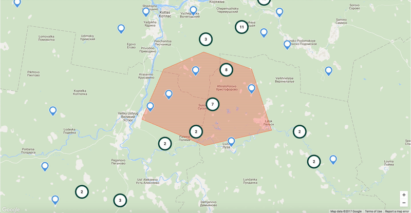

# Polygon Filter on Clustered Google Maps Markers
Based on <a href="https://github.com/istarkov/google-map-clustering-example">Google Maps React Clustering Example</a> and <a href="https://github.com/lucasmogari/google-map-react-example">Google Maps React Polygon Example</a>, this is a proof of concept using polygons as filters on clustered Google Maps markers.

